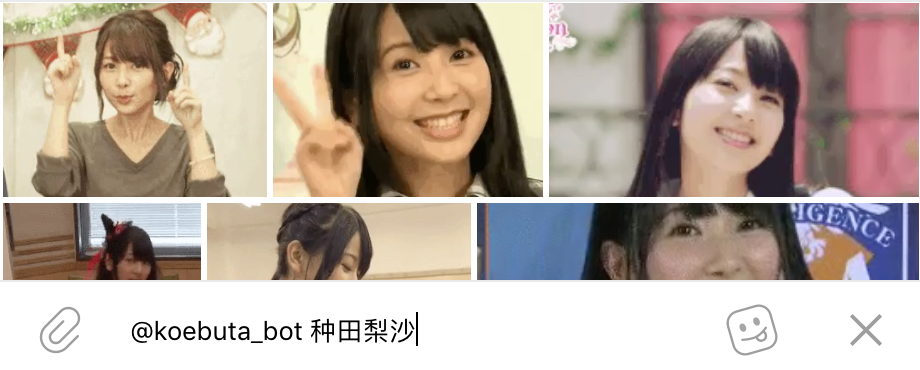

# Dedicatus

A Telegram inline bot that searches GIFs of Seiyuu, running on Google App Engine.

## 使用方法

1. 和 Bot [成为好朋友](https://t.me/koebuta_bot)。
2. 在任意对话中输入 `@koebuta_bot <姓名>`。
3. 选！
4. 重复以上两步若干次，Telegram 就会在输入 `@` 时自动提示 `@koebuta_bot` 了。

`<姓名>` 的部分可以使用空格分隔多个声优。所有指定声优均出现的图才会被返回。此搜索支持使用别名，例如搜索「种酱」将会返回種田梨沙。别名也可能指向多个声优，例如搜索「樱熊」将会返回佐倉綾音和村川梨衣同时出现的图。
 
### 添加未索引的声优 / 给已索引的声优增加别名

1. 给 Bot 发送消息 `/s <姓名>`。
2. 如果 Bot 回复 `Found Personality`，则已经被索引，但是您仍然可以增加别名；如果 Bot 回复 `Not found`，则未被索引。
3. 找一个 Admin，告知想要增加的声优和别名。

若您找不到一个 Admin，可以直接在本项目提交 Issue。

### ~~再~~生产 GIF

参见 [extras/mpv_gif](extras/mpv_gif)。

### 添加 GIF

1. 把 GIF 发送给 Bot。
2. Bot 会回复 `New GIF XXXXXXXX`。
3. 找一个 Contributor，告知上一步中获得的 GIF ID 和应当关联的声优。

若您找不到一个 Contributor，可以直接在本项目提交 Issue。

### 成为 Contributor

可以通过给 Bot 发送消息 `/me` 来确认您的 UID 和权限。

目前成为 Contributor 主要靠随缘。

### 新功能许愿 / Bug 报告

找一个 Admin，吼。

或者

在本项目提交 Issue。

### Admin & Contributor Guides

* [Admin Guide](https://github.com/SSHZ-ORG/dedicatus/wiki/Admin-Guide)
* [Contributor Guide](https://github.com/SSHZ-ORG/dedicatus/wiki/Contributor-Guide)

### 部署新实例

1. 找 [BotFather](https://t.me/botfather) 创建一个 Bot。
2. 在 BotFather 启用 Inline Mode 和 Inline Feedback。
3. 复制 `config` 目录下的 `config.go.template` 为 `config.go`。
4. 编辑 `config.go`，设定 Telegram API Key, Knowledge Graph API Key 以及初始 Admin Telegram UID。
5. `gcloud app deploy`。
6. 访问 `https://your-application-id.appspot.com/admin/register`，应当看到一个 `true`。
7. Profit!

### Some Random Technical Details

#### Why Google App Engine + Golang?

* GAE is (almost) free, and it scales itself.
* We have a dependency on Knowledge Graph API.
* Golang on GAE provides very high throughput even with only one instance. Each request runs in a goroutine and we can use all the blocking calls to external APIs.
* I cannot properly write non-trivial Python applications.

#### Why store user roles in one Config entity, instead of using a User Role table?

* So we can store this small entity in memcache, which takes 1ms to come back.

#### Then why don't store config like Telegram API Key together in Config entity?

* So we don't require any parameters in `/admin/register`.
* So we can dump the whole database and directly upload to another instance.

#### Why all queries are implemented with `KeysOnly()` + `GetMulti()`

* No good reason. `GetMulti()` is powered with memcache so should not be much slower.
* We may want random drawing of results in the future. This can only be done with `KeysOnly()` + `GetMulti()`. 

#### Why use Offset() in pagination?

* Telegram `answerInlineQuery.next_offset` supports max 64 bytes. Datastore Cursor is 100% larger than that.
* We don't want to store Cursor locally (even in memcache).
* Most importantly: we don't care if some results are missing / duplicated.

## License
